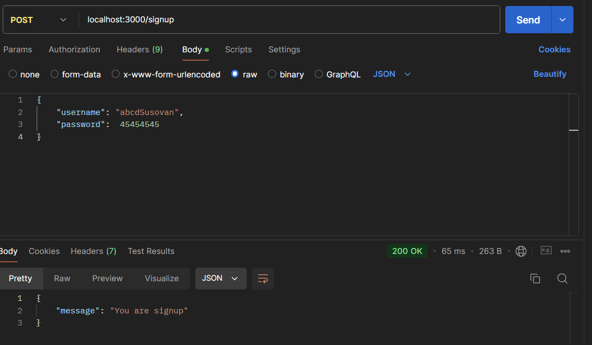
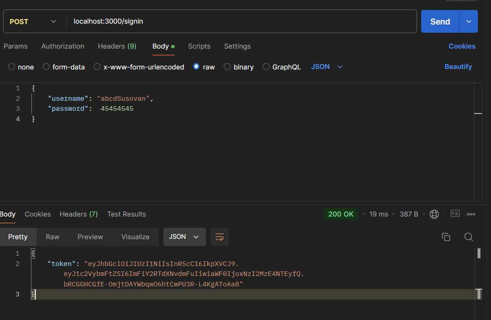
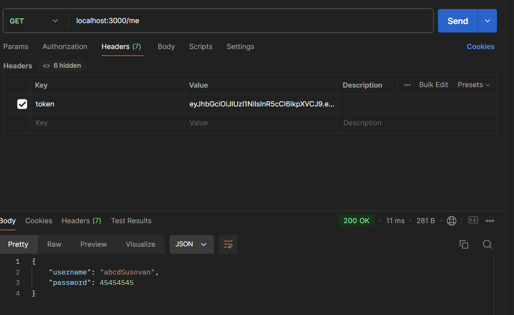

# JWT Authentication API

This is a simple authentication API built using **Node.js** and **Express.js** with **JSON Web Tokens (JWT)** for authentication.

## Features

- **Sign up** a user with a username and password
- **Sign in** a user and generate a JWT token
- **Access user information** using the token

## Sign up Route

## Sign in Route

## Me Route to get user info using JWT

